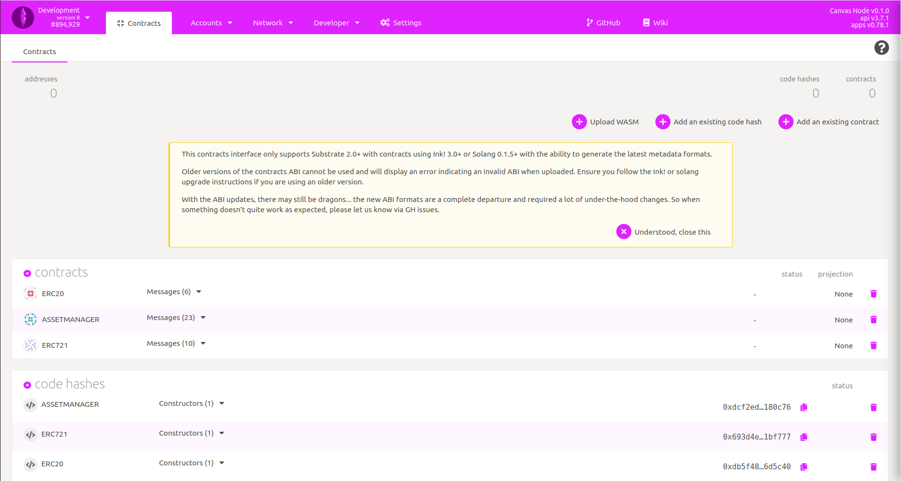
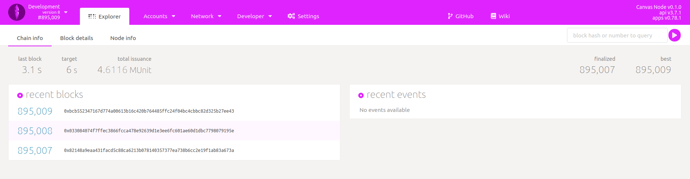

# 🎨 Connecting Polkadot JS


The local node provides two RPC endpoints:

* HTTP: `http://127.0.0.1:9933`
* WS: `ws://127.0.0.1:9944`




With Polkadot JS Apps connected, you will see our node producing blocks.

