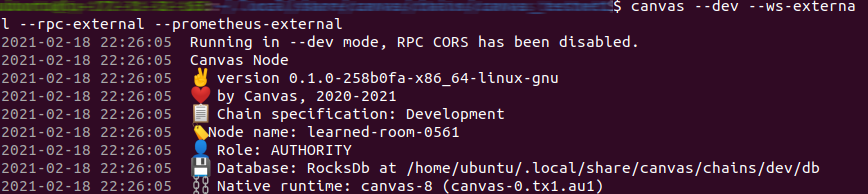

# ✅ Setting Up The Node

### [✔️](https://emojipedia.org/check-mark/) Installing The Canvas Node

```bash
$ cargo install canvas-node --git https://github.com/paritytech/canvas-node.git --tag v0.1.5 --force --locked
```

### 🚀 Run The Node

```bash
$ canvas --dev --ws-external --rpc-external --prometheus-external
```

You should see something like this.



